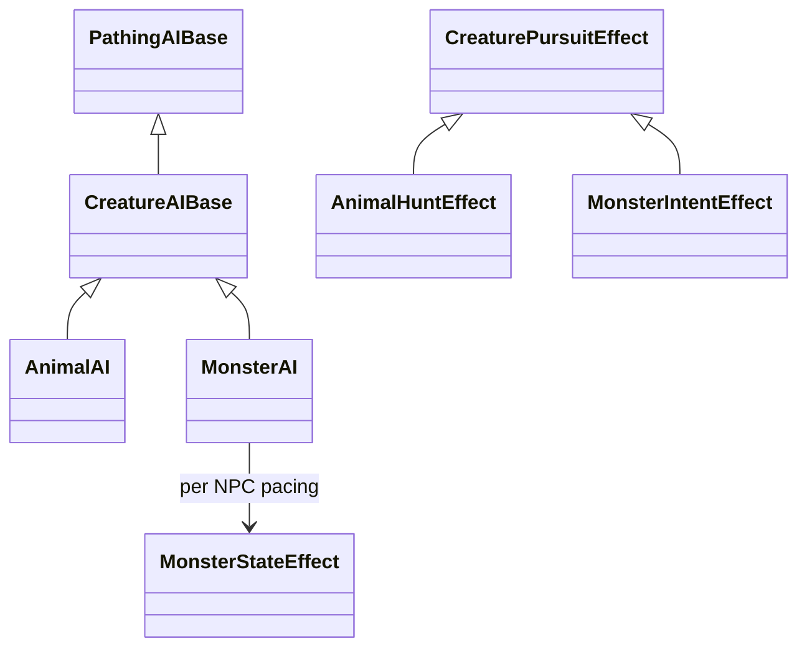

# Monster AI v1

`Monster` is an individual creature controller for threats whose decisions should not depend on an ecological life cycle. It shares movement, observation, shelter, refuge, assessment and pursuit mechanics with `Animal`, but owns its motives and pacing. Attaching it does not change an NPC's needs model. A `NoNeeds` dragon can defend its lair or hunt at night without consuming a daily supply of cattle.

## Architecture and compatibility



`CreatureAIBase` holds the reusable physical mechanics and stateless strategies. Its policy hooks cover social trust, eligibility, motivation, hunt creation, expiry, completion, movement suitability and cleanup. `AnimalAI` retains feeding, water, sleep, seasonal dormancy, ecology, group participation and legacy predator policy. The persisted `Animal` discriminator, existing XML section names and `AnimalHunt` effect key remain supported. Existing Animal needs conversion remains Animal-only.

`MonsterAI` registers the persisted type `Monster` and builder type `monster`. Its versioned `<Monster version="1">` section adds motives and activity restrictions to the shared XML. Saved intent and pacing use the existing effect store; no database migration is required.

Use exactly one primary Animal or Monster controller on an NPC. Template/live attachment commands reject conflicting primary controllers. Monster members are rejected by Wildlife group assignment, and runtime conflict checks disable conflicting Monster work in older or manually edited data. Existing Animal Wildlife groups retain their behavior. Auxiliary AIs, such as an authored NaturalTrap AI, can accompany a Monster.

## Motives and priority

New Monster definitions have no proactive motive. Enable only the reasons that fit the creature.

| Motive | Meaning |
| --- | --- |
| Self-defence | Implicit response to an observed opponent attacking the monster; ordinary combat remains authoritative. |
| Provocation | A recent observed attacker, or an owned-trap capture when `trapprovokes on`, can justify pursuit. |
| Territory | An observed eligible intruder within the configured home radius receives a warning before attack. |
| Condition | An activity condition prog must be bound and evaluate true. Other configured restrictions also apply. |
| Scheduled | Hunt when the configured activity window matches. With no restrictions this is always active. |
| Hunger | Requires `feeding Needs`, actual hunger and edible prey. |

This table is also the selection priority. Absolute exclusions, allies, observation, anatomy, movement and combat permissions are checked before assessment. Confidence and assessment weights never override those gates. Monster targets have no Animal people/food classification unless the selected motive is Hunger.

Territory and provocation normally work outside the proactive activity window. `defencewindow on` applies that window to both. Self-defence does not wait for a hunting schedule. Cooldowns suppress new proactive and retaliatory pursuits, but do not prevent ordinary self-defence in an existing fight.

Warning state is per NPC and target. Leaving the defended area clears an idle warning at the next evaluation. Target changes restart the warning. Configure a warning emote with `$0` for the monster and `$1` for the target.

## Activity windows

Native restrictions combine with **AND**; values within one restriction combine with **OR**:

- Local time bands: Dawn, Morning, Afternoon, Dusk and Night.
- Local season groups, using the world's authored names.
- A selected calendar's month aliases and inclusive day-of-month range.
- A selected, locally present lunar celestial's phase.
- An additional `Boolean(Character)` FutureProg.

The calendar's actual current date is used, including short months and intercalary definitions. A date that does not exist in a month cannot match. Lunar phases are optional; werewolf content does not impose a full-moon rule. Missing calendars, moons, season/month bindings or invalid condition/ally/target progs are reported by readiness and diagnostics and prevent the affected controller from initiating work.

Schedules use game time. Warning, provocation, cooldown, feeding and pursuit durations use real seconds; the engagement delay is a dice expression in milliseconds. A closed window is checked again at delayed engagement, path callbacks and combat tactic selection. Existing combat exits through ordinary disengagement rules; the AI does not teleport out of combat.

## Pursuit, home and persistence

Pursuit stores the AI and target identities, motive, origin, latest genuine sighting (cell, layer and route coordinate), phase, deadline and actual capture/venom receipts. It follows observed positions and detectable, unambiguous physical trails. An unseen target does not supply its current position, internal health, skills or resources to assessment.

Range, total duration and lost-sighting duration bound every pursuit. Territory additionally uses the home as a leash origin. On completion or abandonment, the controller clears its own path, door and engagement work and starts its cooldown. Optional return-home pathfinding includes the ambient movement range and pursuit range. An unreachable home retries after 30 seconds and reports that condition. No inaccessible home or missing target grants movement or attack privileges.

Home and den mechanics are shared with Animal AI. Bind a stable `Location(Character)` home prog for a lair or haunt; for example, `return tolocation(123)` for a particular cell. A moving `@character.location` result is not a fixed lair. Item anchors, site selection and crafts must be supplied for den/web construction. Diagnostics point out missing home setup.

State belongs to the NPC, not the shared AI definition. `MonsterIntent` retains valid intent across reboot; `MonsterState` retains warnings, provocation deadlines, cooldowns, return retry and bounded feeding progress. Loading validates references and deadlines but never initiates an attack, applies a trap payload, injects venom or consumes food. The next ordinary event resumes valid behavior. Expired intent receives cleanup and cooldown. Detaching the controller removes only its owned intent, pacing and transient actions.

## Feeding and combat

| Feeding mode | Behavior |
| --- | --- |
| Off | Default. No hunger or consumption loop. |
| Needs | Uses the NPC's existing needs model, native drinking and edible corpse consumption. It does not enable a needs model. Thirst takes priority over hunting. |
| AfterKill | Attempts a bounded number of native bites from the pursued victim's accessible corpse, within a finite deadline, even with NoNeeds. Anatomy, corpse access and ordinary eating checks still apply. |

Monster AI chooses intent; the existing combat engine chooses and resolves attacks. Weapon users need a race that permits weapons, suitable equipment, skills and compatible combat settings. Configure the ordinary unarmed fallback for disarming or missing gear. The controller neither creates equipment nor grants proficiency.

Authored `MagicAttackPower` powers use normal magic/psionic combat weights, capability/learned-power access, range, resource costs and resolution. Compatible powers can be granted through existing capability merits. A Monster profile does not grant powers, a spellbook, mana or a new autonomous casting planner. `impdebug monster` lists attached compatible powers and, for an observed target, how many are currently usable.

Use `combat config psychic <percentage>` for psionic combat powers. Retain a positive natural or weapon attack weight when the creature should keep attacking after its powers become unavailable. Native selection uses those configured weights; assigning 100% to an unavailable power category does not guarantee a physical fallback.

The combat settings' target permissions also apply: a creature configured not to attack helpless or critically injured opponents can stop striking such a target even while its Monster intent remains active. `NoNeeds` does not grant water breathing or remove anatomical, stamina, injury or movement restrictions. An aquatic setup must account for the race's actual breathing capabilities.

Direct, Ambush and TrapWait openings and Fight, Extract and VenomWithdrawal follow-ups use [the shared predator mechanics](./Predator_Hunting.md). A trap must have actually captured prey and belong to that creature. Extraction requires authored anatomy/attacks and opposed control. Aerial dropping uses the normal Dropper combat strategy and lift limits. Venom withdrawal requires an actual positive delivered dose, not an attempted bite. Missing prerequisites retain ordinary combat checks and bounded pursuit rather than inventing the missing capability.

## Builder workflow

```text
ai edit new monster "Marsh Night Hunter"
ai set motive Scheduled
ai set active times Night Dawn
ai set active seasons Autumn Winter
ai set allies same on
ai set targets selection Safest
ai set feeding Off
ai set movement Amphibious
ai set hunting opening Ambush
ai set hunting followup Extract
ai set hunting layer Underwater
ai set hunting range 5
ai set hunting timeout 300
ai set hunting lost 60
ai set cooldown 900
ai show
```

For a guardian, use `motive Territory`, bind `home location <prog>`, set `guardrange 0` for the home cell, `warning 20`, `warningemote <text>` and `returnhome on`. For a periodic curse, add `active calendar <calendar>`, `active months <aliases>`, `active days 1 3`, optionally `active moon <moon> Full` and/or `active condition <prog>`.

`motive <name>` toggles that motive; `motive clear` removes all proactive motives. `active times|seasons|months all`, `active days all`, and `active calendar|moon|condition clear` remove their respective restriction. Month/day filters require a calendar. `targets eligibility` accepts `Boolean(Character,Character)` and `targets preference` accepts `Number(Character,Character)`. `allies prog` accepts `Boolean(Character,Character)`.

Use `ai clone <id> <custom name>` before tailoring a stock profile. Attach to a template with `npc set ai add <id>` or a live NPC with `ai add <id> <npc>`, after removing its old primary controller. Read `ai set help` for shared movement, awareness, shelter, refuge, door and assessment controls.

Founder diagnostics: `impdebug monster [here|<NPC id>] [target id]`. The report covers readiness, window, intent, observed target eligibility/assessment, home, cooldown, warnings, feeding, weapons and authored power setup. `impdebug wildlife` retains its existing Animal/group meaning.

## Stock catalogue

The Mythical Animal and Supernatural seeders add these reusable profiles according to their race recommendations:

| Profile | Starting behavior and setup |
| --- | --- |
| Monster - Lair Guardian | Territory/provocation; bind a home and target policy. |
| Monster - Night Stalker | Night schedule/provocation; optional home. |
| Monster - Conditional Hunter | Condition/provocation; deliberately incomplete until a condition prog is bound. |
| Monster - Aerial Hunter | Flying ambush/extraction; authored flight/lift attacks and Dropper settings where appropriate. |
| Monster - Aquatic Ambusher | Amphibious underwater extraction; suitable terrain and attacks. |
| Monster - Trap Ambusher | Denning TrapWait/venom withdrawal; authored craft, anchor and NaturalTrap AI. |
| Monster - Venom Ambusher | Ambush/venom withdrawal; actual envenoming attacks. |
| Monster - Burrow Ambusher | Denning ambush; authored burrow setup. |
| Monster - Relentless Pursuer | Longer bounded pursuit and confident assessment; still respects all absolute gates. |
| Monster - Bound Haunt | Home-bound territory/provocation; authored home and ordinary planar access. |
| Monster - Armed Guardian | Guardian with door/key use; authored loadout, skills and combat settings. |
| Monster - Powered Guardian | Guardian with door/key use; authored powers, resources and combat settings. |

The source-generated [recommendation manifest](../../DatabaseSeeder/Assets/Manifests/Monster_AI_Recommendations.json) covers all 43 mythical and 46 supernatural races, including alternatives, native attacks, physical setup and limitations. Peaceful wildlife and sapient roles are identified explicitly rather than being automatically converted to hostile monsters. Existing Wildlife templates and group recommendations are unchanged.

The exact twelve stock names are seeder-owned: reruns update their definitions in place and preserve IDs. Custom clones under other names remain untouched. A stock-name collision with another AI type is reported rather than converted. These profiles are additional choices; no NPCs are automatically assigned the new controller.

V1 does not implement Monster groups, blood feeding, resurrection, phylacteries, petrification, autonomous spellbook selection or other lore-specific powers. Race metadata, authored attacks and existing magic remain the source of those capabilities.

## Verification

See [MonsterAISmokeWorld](../../scripts/MonsterAISmokeWorld/README.md) for native acceptance and its evidence record. Automated coverage lives in `MonsterAITests`, the existing AI/predator/pathing/combat suites and `MonsterAIStockTemplateTests`. The proposal remains available as the approved design record, not a second command reference.
