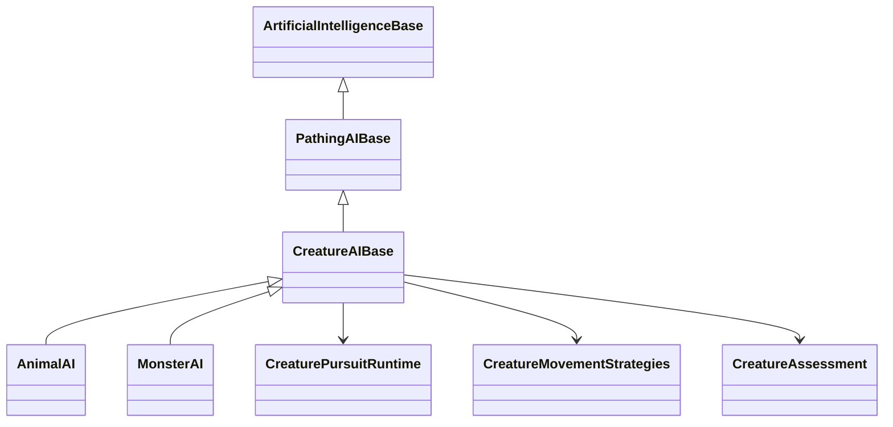

# Monster AI v1 proposal

Status: approved for implementation on 2026-09-29. Investigation date: 2026-09-29. Source baseline: `960155fa`. Delivered behavior and executable commands are documented in [Monster AI](./Monster_AI.md).

This document records the approved design for a separate, builder-creatable `MonsterAI`, sharing creature mechanics with `AnimalAI`. The findings and illustrative syntax below describe the original investigation; the implementation guide is the current command reference.

## 1. Recommendation

Create sibling `AnimalAI` and `MonsterAI` implementations under a new `CreatureAIBase : PathingAIBase`. Extract reusable movement, observation, home/refuge, threat response, assessment, and pursuit mechanics into that base and small runtime strategies. Each concrete AI owns its priorities, motivation, and lifecycle policy.

Animals retain their current ecological behaviour. Monsters gain configurable reasons to act that do not require hunger: scheduled hunting, territorial defence, provocation, and authored conditions. A monster can hunt or eat without needing a simulated daily food supply. Weapons and combat magic continue through the existing combat engine.

The proposed v1 also adds stock Monster AI definitions and a recommendation catalogue for the Mythical Animal and Supernatural packs. These are additional builder choices. Existing Animal/Wildlife definitions, recommendations, attachments, and live groups retain their meaning.

The most important scope choices are:

- Implement time-of-day, season, calendar month/day, and optional selected-moon conditions as normal builder settings, with FutureProg for additional world-specific policy.
- Reuse all currently supported predator openings and follow-ups, including traps, extraction, aerial dropping, and venom withdrawal where anatomy and attacks support them.
- Support armed monsters and already-authored combat magic/psionic attack powers through ordinary combat settings.
- Keep monster coordination outside Wildlife groups out of v1. Preserve existing animal packs and provide individual Monster alternatives.
- Defer autonomous spellbook management and new species mechanics such as petrification, blood feeding, resurrection, and phylacteries.

## 2. What the source already provides

| Finding | Consequence for this design |
| --- | --- |
| `AnimalAI` already derives from `PathingAIBase`, with movement, feeding, water, home, awareness, refuge, activity, and threat strategies nested inside it. Those strategies take concrete `AnimalAI` parameters. | There is a real extraction seam, but merely adding overrides to one hunting method will not make the implementation reusable. |
| The predator additions supply observable risk assessment, explicit prey policy, bounded pursuit, ambush/trap openings, extraction and venom withdrawal. `AnimalHuntEffect` stores per-NPC intent and participates in normal combat move selection. | Preserve these mechanics and their physical checks. Separate them from ecological motivation. |
| Hunger, thirst, edibility and eating are consulted in eligibility, hunt startup, continuation, path selection and completion. | Remove those assumptions from the shared pursuit runner and supply them through Animal policy. Monster policy must cover the entire pursuit lifecycle. |
| `NPC.EnsureProductionWildlifeNeeds()` converts needs when an attached `AnimalAI` has `UseActiveNeeds`. Removing that AI does not itself convert needs back. | Monster AI must not inherit this opt-in accidentally. Converting an existing NPC's AI and converting its needs are separate, explicit builder operations. |
| Individual AI objects are shared definitions; effects hold owner-specific state. NPC dispatch short-circuits ordinary AIs, while observers such as `NaturalTrapAI` receive their subscribed events independently. | No targets, cooldowns or activation state on the shared Monster definition; preserve auxiliary trap maintenance and existing dispatch rules. |
| Wildlife group hunting is hunger-driven and directly calls/enumerates `AnimalAI`. This includes sightings, prey selection, attack dispatch, and activity policy. | Do not silently replace members of existing animal groups with Monster AI. A future group extension needs an explicit coordination contract. |
| Standard melee and ranged strategies already select usable weapons and `MagicAttackPower` instances using combat settings, including separate magic/psionic percentages. | A second weapon or magic selector in Monster AI is unnecessary for v1. |
| Mythical Animal contains 43 races: 32 wildlife-eligible beasts and 11 humanoid/sapient entries. Supernatural contains 46 races and currently seeds no individual AI. | Catalogue coverage must distinguish monster encounters, wildlife, and sapient NPC roles. Being mythical does not imply indiscriminate hostility. |
| Forty-four supernatural races are non-living with zero hunger/thirst/breathing rates; Werewolf and Werewolf Hybrid are living. Forty supernatural templates permit weapons, but the pack does not supply equipment or spell loadouts. | Weapon capability and supernatural attack prose are not evidence of a configured armed NPC or spellcaster. |

These packages provide races, attacks, AI definitions where applicable, and recommendation data. They do not currently populate the world with NPC templates or live monsters.

## 3. Shared architecture and override boundaries



The names are proposed implementation names. This is a small extraction around the existing architecture, not a new general behaviour-tree framework.

| Shared mechanics | Animal-owned policy | Monster-owned policy |
| --- | --- | --- |
| Ground, swimming, flying, arboreal and amphibious movement; ordinary and spatial paths; layer feasibility; inherited door handling. | Habitat/ecology priorities, feeding and water searches, seasonal migration/rest interactions. | Lair residence, patrol/wander permission, pursuit leash and return-home priorities. |
| Perception-limited scanning, sightings, threat memory, social checks, hiding/stalking and refuge movement. | Existing same-race/group trust and wildlife responses. | Configurable allies, target exclusions, intruders, provocation and authored enemy predicates. |
| Home-cell/anchor resolution, territory primitives, shelter construction when explicitly requested. | Denning, nesting, parenting and ecological shelter rules. | Guard an authored lair/anchor; optionally construct a hunting site for trap users. |
| Observable target assessment, ranking, delayed engagement and bounded pursuit. | Hunger, edible prey, people-as-prey policy, starvation adjustment and carrion preference. | Motive and activation rules, target policy independent of edibility, persistence/retreat choices and episode cooldown. |
| Direct/ambush/trap preparation; extraction and venom tactics; normal disengagement and completion notifications. | Feed after a hunt and resume ecological activity. | Optional bounded feeding, then resume guarding, return to lair, or wait for another activation. |

The base provides operations, with narrow protected hooks for selecting an intent, checking initiation/continuation policy, assessing allies and targets, and handling completion. Each subclass retains its event priority policy. Shared code should not branch on `this is MonsterAI` or require dummy feeding strategies to initiate pursuit.

Extract the existing stateless strategy implementations where reusable. Keep Animal-only ecology strategies with `AnimalAI`. Retain public Animal names and compatibility adapters where callers or persisted data depend on them; avoid renaming every existing enum or interface just for symmetry. Runtime-only strategy contracts stay in `MudSharpCore`; genuinely shared public contracts belong in `FutureMUDLibrary`.

Other AIs, including Aggressor, Wanderer, SelfCare and legacy herd AIs, do not need to move to this base. Small helpers already used outside Animal AI must retain compatible entry points or have their callers updated in the same extraction.

## 4. Monster motivation and priorities

Monster configuration combines a small set of motives with reusable tactics. A dragon, ghoul and sentinel use data profiles rather than separate C# subclasses.

| Motive | Initiation and termination |
| --- | --- |
| Scheduled hunt | Seek eligible observed targets while the configured window is open. Stop new attacks when it closes; abandon pursuit through normal disengagement. Apply a configurable cooldown after an episode. |
| Lair/territory defence | React to an observed non-ally inside the defended area. Configure warning/posturing or immediate engagement; leash pursuit to the defended area and return afterwards. |
| Provocation | Record a real attacker or configured intrusion/trap event, with an expiry. Pursue only under normal observation and reachability constraints. Repeated events update one intent rather than queuing duplicate attacks. |
| Authored condition | A Boolean activation prog can enable hunting, for example when a quest flag, weather condition or world event applies. A separate target prog selects whom this concerns. Ordinary builder settings cover the common cases without programming. |
| Hunger, optional | Honour an existing active needs model and the appropriate edible-prey checks when the builder deliberately selects a needs-driven monster. |

Multiple enabled motives are alternatives, with explicit precedence. Schedule and extra condition settings gate proactive hunting; they do not make a creature unable to defend itself. Territory/provocation can be configured to observe the same window, with self-defence remaining a distinct purpose. A new empty Monster definition is non-proactive until a motive and valid target policy are configured.

The proposed priority is: engine state/action blockers; immediate combat and defensive response; optional urgent survival handling; current intent; an eligible new defensive/triggered intent; proactive hunt; return to lair; idle movement. Animal AI retains its existing priority order during the extraction. Monster tactical actions must yield to the combat engine's obligatory/manual/inventory actions.

Target policy supports included/excluded lineages, apparent size bounds, ally and eligibility progs, and preference scoring. Food classification is only relevant to a feeding motive. Observation, physical reachability, combat permissions, and configured exclusions cannot be overridden by a high assessment score or an activation event. Monster ally policy must be overridable independently of Animal's existing same-race rule.

Pursuits have a target, purpose, origin, last observation, total deadline, lost-sighting deadline, leash, and ending reason. Use the existing conservative pursuit defaults as the starting point: five cells, five minutes total, sixty seconds without a sighting; profile-specific changes are explicit. A persistent/relentless profile can reduce risk-based retreat and extend configured limits, but cannot bypass incapacity, invalid targets, movement restrictions, timeouts or a leash.

Posturing, pursuit and cooldown provide player-readable pacing. Ending a hunt does not teleport, heal, respawn, or reset a monster. Loss of a home anchor produces a diagnostic and a configured idle/fallback outcome, not an endless unreachable path request.

## 5. Activity windows and triggered behaviour

V1 should include these native condition fields:

- Local time-of-day bands: dawn, morning, afternoon, dusk, night, using the world's existing bands.
- Local `SeasonGroup` selections from the cell's resolved weather controller.
- A selected in-game calendar, optional month selections, and inclusive day-of-month ranges. Use `MudDate` and calendar definitions, including short/intercalary months; do not assume a Gregorian year or 30-day month. A date that does not exist in a month simply does not match.
- Optional lunar-phase selections on an explicitly selected local celestial implementing `ILunarPhase`. A calendar date and a moon phase are separate conditions. Missing/unavailable celestial context does not silently match.
- An optional Boolean `(Character monster)` activation prog and Boolean `(Character monster, Character target)` target predicate.

Values within one condition field are alternatives; different configured fields must all match. No configured restriction means unrestricted for that field. A missing configured calendar, moon or prog is reported and prevents that rule from initiating an attack. Time-of-day and season follow the current cell; calendar dates use the selected calendar's own date/boundary semantics.

This directly supports a night hunter, a seasonal dragon, a monster active on days 1-3 of a fictional month, or an optionally moon-bound werewolf profile. The stock Werewolf form remains free of an imposed lunar transformation rule.

Existing entered-cell, combat engagement and owned-trap-capture events cover the initial native triggers. Hooks on characters, cells or items can set world-specific state read by the condition prog. There is no need to let builders wire arbitrary event payloads into a new AI scripting system in v1.

Conditions are checked on relevant events and bounded periodic evaluation, then rechecked before delayed engagement and combat/pursuit actions. Inactive monsters avoid repeated expensive target scans. Path maintenance continues through `PathingAIBase`; event subscriptions accurately reflect configured work. This is interval-based behaviour, not a promise of frame-exact alarms.

Fictional schedules use game time. Engagement delays, pursuit deadlines and cooldown durations use the existing runtime duration convention and `RuntimeClock`, with units stated in help. Reboot/load never executes missed hunts or replays attacks. Restored state is revalidated against the current world and current window before any new action.

## 6. Needs and optional eating

`MonsterAI` does not replace an NPC's needs model. New monster setup recipes default to `NoNeeds`; a builder can still choose an active model. Merely attaching Monster AI must not enable active food/thirst progression, and removing Animal AI must not falsely promise to undo a previous needs conversion.

Proposed feeding modes are:

- `Off`: neither hunger nor food opportunities motivate the monster.
- `Needs`: use genuine hunger and native eating when the NPC has a suitable needs model.
- `AfterKill`: perform a bounded feeding episode on an accessible edible corpse after a suitable hunt, regardless of hunger, then resume the profile's normal behaviour.

`AfterKill` uses actual corpse material/reach/anatomy checks and native consumption. It has a bite/time limit and cooldown so a no-needs creature cannot enter an endless feeding loop. No artificial starvation is applied to trick predator helpers. This mode is optional: a guardian killing an intruder does not automatically eat it.

No-needs does not remove stamina, wounds, breathing requirements of a living race, environmental exposure, movement costs, or magic resource costs. Vampire blood drinking and supernatural feeding economies remain separate features.

## 7. Weapons, signature attacks and magic

Weapon use already belongs to character combat strategies and inventory plans. Monster AI should engage through the normal character API and use the NPC's configured combat settings, carried equipment, skills and anatomy. An armed monster can therefore draw/wield, attack at appropriate range, use normal defences and fall back according to its combat settings. The AI does not conjure gear or grant weapon skills.

The existing combat engine also automatically selects authored `MagicAttackPower` instances from the character's available powers. Normal and psychic powers use the respective combat percentages, school restrictions, intentions, weightings, availability checks, range and resources. Move resolution revalidates and consumes costs through the native implementation. Compatible attached attack-spell payloads remain part of that path.

V1 should support and test that existing integration, with builder diagnostics for missing powers or incompatible settings. It does not need a Monster-specific spell selector. Native `MagicAttackPower` repetition is governed by combat scheduling, delay, stamina and resources; there is no generic per-power cooldown to claim as already implemented. Any authored availability condition remains authoritative.

The stock supernatural catalogue's Aura/Will-based attacks are mostly natural `WeaponAttack` records, not granted magic powers. A Lich or angel recommendation must say whether it uses existing natural attacks or requires separately authored powers. V1 should not silently create a magic school, assign spellbooks, or change race-wide combat balance.

Autonomous use of arbitrary cast-trigger spells, `SpellBackedPower`, non-combat buffs/healing, Vancian preparation, and configurable-casting resource management is deferred. Those deserve a separate typed action-selection design. Natural ranged breaths, screeches and other existing signature attacks continue through their current combat machinery.

## 8. Catalogue-led v1 profiles

The following are proposed behaviours grounded in existing bodies and attacks. They are not claims that these AIs already exist or statements of mandatory setting lore. Profiles are composable; an armed guardian and a magical guardian share the same motivation.

| Profile family | Representative existing entries | V1 distinction and limits |
| --- | --- | --- |
| Lair guardian | Dragon, Eastern Dragon, Huorn; optional Ent, Minotaur, angels and divine avatars | Defended area, warning/escalation, bounded pursuit, return home. Dragons retain their authored breath attacks. A home anchor can represent a hoard; theft tracking and hoard accumulation are deferred. |
| Scheduled stalker | Warg, Dire-Wolf, Hellhound, Vampire, Ghoul | Hunt on time/condition with no food requirement; stalking, retreat policy and cooldown. Optional real corpse feeding where supported. Vampire blood drain is not supplied. Existing Warg/Dire-Wolf wildlife pack choices remain available. |
| Conditional hunter | Werewolf, Werewolf Hybrid; configurable demonic or mythic hunters | Calendar, selected-moon or other condition governs aggression. This does not implement or force transformation. |
| Aerial hunter | Griffin, Garuda, Giant Eagle, Wyvern, Fell Beast | Shared aerial pursuit and Dropper behaviour with real control, lift capacity, carried burden, altitude and falling checks. Can be driven by a schedule or territory instead of hunger. |
| Aquatic ambusher | Bunyip, Yacumama | Shared ambush and extraction/drowning behaviour, optional after-kill feeding, return to its lair. Respects target water safety and physical hauling constraints. |
| Trap/burrow ambusher | Giant Spider, Giant Scorpion, Giant Centipede, Ankheg, Giant Worm, Colossal Worm | Waiting-site preparation, existing `NaturalTrapAI` auxiliary, actual owned capture receipts, appropriate fight/venom follow-up. No free capture or injected venom. |
| Persistent pursuer | Zombie, Skeleton, Mummy; optionally Ghoul | Little or no risk-based retreat, bounded target memory and pursuit, no ecological foraging. Skeleton/Mummy can use weapons when equipped; Ghoul/Zombie templates do not permit weapons. |
| Bound haunt | Ghost, Specter, Wraith, Spirit, Ancestral Spirit, Nature Spirit, Elemental Spirit | Defend or patrol an authored place, activate on intrusion/conditions, return when pursuit ends. Retain planar/corporeality restrictions. No possession or unearned cross-plane targeting. |
| Armed or powered guardian/hunter | Minotaur, Naga, Centaur, Lich, Vampire, suitable angel/demon/divine entries | Existing combat settings/equipment or authored combat powers give the tactical distinction. No autonomous social role, spellbook or automatic equipment grant. |

The review also found useful exclusions:

- Phoenix has beak/talon attacks; rebirth/fire behaviour is not established by its prose.
- Basilisk and Cockatrice have ordinary bite/tail or beak/talon attacks; petrification is not currently supplied.
- Ent has ordinary unarmed attacks; Minotaur has gore/ram/elbow, and Naga has bite/tail attacks. Their humanoid/sapient role is a builder choice.
- Unicorn, Pegasus, Hippogriff, Hippocamp, Pegacorn and Qilin should retain peaceful wildlife/guardian choices. Humanoid and sapient catalogue entries must not automatically become hostile monsters.
- Elemental Spirit currently shares the spirit attack set; its name does not establish distinct elemental spellcasting.

Implementation should produce an exhaustive recommendation manifest covering all 89 current entries, including explicit `retain Animal/wildlife` or `builder-authored sapient role` dispositions where appropriate. Each proposed Monster recommendation identifies its motivation, tactic, supported combat setup, optional auxiliary AIs, required world bindings and any unsupported lore. This is an AI catalogue pass, not an attack rebalance.

## 9. Persistence, seeding and existing worlds

Persist the new AI with discriminator `Monster` and builder type `monster` in the existing AI table/XML system. No database schema change is expected. Use versioned Monster XML with explicit defaults and validation. Include database and builder loaders, save/load/clone coverage, `IsReadyToBeUsed`, accurate event subscriptions and an explicit `CountsAsAggressive` policy so other NPC systems classify the new AI consistently.

Keep existing `Animal` XML element names, enum values, absent-field behaviour, IDs, cloning and registration valid. Retain the `AnimalHunt` saving-effect key and its loader via a compatibility wrapper around shared pursuit state/runtime. Add a separately identified monster intent effect carrying its motive, target observations, trigger expiry and cooldown as needed. Both resolve their owning AI by identity and revalidate on load without executing side effects.

Per-NPC state is saved on effects, not on shared AI definitions. Disabling/removing a Monster AI invalidates its own intent and owned paths; it does not cancel another system's movement or replay an incomplete attack. Editing a shared definition rechecks live policy on the next decision; cloning copies configuration only.

Recommended stock ownership:

1. Put shared stock Monster definitions in a `MonsterAIStockTemplates` utility, with pack-specific recommendations under the owning Mythical/Supernatural seeder directories.
2. Have the existing pack seed paths add/reconcile clearly named `Monster - ...` definitions, using stable identities and the existing repeatability conventions. New content must also be installed when an existing world reruns its already-installed pack.
3. Preserve existing `Animal - ...`, `Wildlife - ...`, `Managed Animal - ...` definitions and all live/template attachments. Do not overwrite those rows or change their `Type` in place.
4. Export a separate source-backed Monster recommendation manifest and builder guide. Keep current Wildlife recommendations intact rather than changing their contract from one wildlife choice per eligible race.
5. Preserve differently named builder clones and custom attachments. Stock reconciliation owns only the new documented stock definitions. No map-bound lairs, NPC populations, magic schools or equipment loadouts are silently installed.

Existing monsters can be adopted by cloning a Monster definition, binding home/conditions, deliberately replacing the primary individual AI, and choosing the desired NPC/template needs model. A builder preflight should diagnose competing primary Animal/Monster definitions and unsupported Wildlife group combinations; normal setup must not run two primary creature controllers against one NPC. Auxiliary natural-trap, emoter or self-care AIs remain subject to their existing event/priority contracts.

### Group compatibility decision

V1 Monster profiles are individual controllers. Existing Wildlife groups continue to use Animal AI, including their current needs, sentries, prey policy and rest behaviour. Aerial flights, Warg/Dire-Wolf hunting packs and Dire-Bear families must remain functional after extraction.

The Monster catalogue must not recommend pairing a new Monster AI with those Wildlife hunting templates. A grouped monster implementation would require generic group observation/intent participation, member-specific motives and control ownership. That is a useful later extension, but would expand this proposal into a group-policy redesign. The shared base should leave a clean seam for it without implementing it now.

## 10. Builder experience

Continue the existing `ai edit new`, `ai set`, `ai show` and clone workflows. Reuse movement/home/awareness/hunting terminology where its meaning remains appropriate. Separate target policy from food policy in Monster help.

Representative proposed syntax (illustrative, not currently executable):

```text
ai edit new monster "Marsh Night Hunter"
ai set motive scheduled
ai set active times Night Dawn
ai set active seasons Autumn Winter
ai set active calendar <calendar>
ai set active days 1 3
ai set active moon <moon> Full
ai set active condition <boolean prog>
ai set targets eligibility <boolean prog>
ai set feeding off
ai set hunting opening Ambush
ai set hunting followup Extract
ai set hunting layer Underwater
ai set hunting range 5
ai set hunting timeout 300
ai set hunting lost 60
ai set home location <location prog>
ai set returnhome on
ai set cooldown 900
```

These active restrictions are cumulative; most profiles use only one or two. Exact command names will be checked against existing parser conventions during implementation. Month/day and moon settings must list valid world values and explain unavailable bindings.

`ai show` should explain the configured motive, current-window rule, targets/allies, home/leash, tactics, feeding, pursuit and cooldown. Live Founder diagnostics should show the current intent and why the NPC is idle, a target was rejected, a schedule does not match, a path cannot proceed, or an armed/powered setup is incomplete. Diagnostics must not grant the AI knowledge of unseen target condition. Preserve `impdebug wildlife` and add a Monster equivalent rather than changing the meaning of the existing wildlife report.

## 11. Implementation sequence after approval

1. **Compatibility baseline and extraction.** Characterize existing Animal event ordering, legacy/new XML, needs conversion, group hooks and saved hunts. Introduce the base/shared strategies and migrate Animal internally with unchanged external behaviour. Keep small compatibility wrappers for external consumers.
2. **Monster core.** Add registration, builder configuration, diagnostics, no-needs motivation, schedule/trigger evaluation, persistent intent, bounded pursuit, optional feeding and home-return behaviour. Supply explicit hooks for subclass policy.
3. **Combat integration.** Demonstrate natural, armed and existing combat-power configurations through native strategies. Exercise shared traps/ambush/extraction/venom tactics and fallback when prerequisites are absent. No general spellcaster implementation is added.
4. **Catalogue content.** Seed the new definitions through existing packs, add the exhaustive recommendation manifest and practical setup recipes, and test fresh install/rerun/custom-clone preservation. Keep Wildlife group choices unchanged.
5. **Acceptance and documentation.** Run relevant unit suites and isolated native scenarios, verify saving/reloading independently, and update the AI runtime, predator, supernatural and builder documentation to describe delivered behaviour and limitations.

Each stage has a concrete acceptance boundary; failure in the Animal compatibility baseline must be resolved before treating the new Monster behaviours as complete.

## 12. Verification plan

No automated or native runtime tests were run for this design-only investigation. The following checks belong to the approved implementation.

| Area | Required evidence |
| --- | --- |
| Animal compatibility | Existing `NpcAiRegressionTests`, `PredatorHuntingTests`, scan/route tests, AI event subscription/dispatcher tests and affected pathing tests remain valid. Legacy XML and saved hunts still work; natural-trap observer ticks, group prey gates, needs opt-in, dormancy and defence/hunt separation are preserved. |
| Motivation and needs | A satiated `NoNeeds` Monster can hunt on a configured motive; the corresponding Animal cannot initiate a hunger hunt. Monster attachment does not convert needs. Food-only checks do not reject an inedible enemy of a non-feeding monster. Needs mode and bounded after-kill consumption behave separately. |
| Schedules and triggers | Time bands, season groups, custom months/day ranges, short/intercalary months, selected lunar phases and extra conditions work alone and together. Closing a window during a delayed attack cancels initiation. Repeated events do not duplicate intent; missing references are diagnosed; downtime does not produce catch-up attacks. |
| Perception and pursuit | Unseen targets never supply live coordinates or hidden health/resources. Policy is rechecked before action. Timeout, lost sighting, leash, unreachable layers, route coordinates, doors, combat blockers and planar restrictions produce bounded outcomes. |
| Combat | Equipped armed Monster uses normal combat; disarm/missing gear has the configured fallback. Authored magic/psionic power selection respects combat settings, range, resources and native resolution; insufficient resources fall back through existing combat rules. Shared tactics retain opposed control, weight limits and actual venom/capture receipts. |
| State ownership | Two NPCs using one AI have independent targets, cooldowns and homes. Save/reload retains only valid intent; stale targets, changed AI, deleted anchors and expired deadlines fail safely. No attack, venom, trap payload or resource debit is replayed on load. |
| Catalogue | Fresh install, rerun, stable IDs, both pack orders permitted by prerequisites, complete recommendations, preserved custom clones and unchanged legacy Wildlife metadata. Recommendations never claim missing powers/gear or unsupported group operation. |
| Native acceptance | Isolated examples: nocturnal no-needs hunter; lair guardian with warning/leash; trap or aquatic hunter; armed sentinel; authored combat-power user; relentless pursuer. Include a second observer where needed, a flush and independent persistence read, then reboot/reload of active intent. |

Run the affected Core and DatabaseSeeder suites, plus Library tests if shared contracts change, using the repository verification scripts/single-node guidance. Update structural/source-location tests to the extracted ownership where necessary, retaining behavioural assertions. Full-solution, climate and release checks are not implied by this change.

## 13. Source map

- [Animal AI](../../MudSharpCore/NPC/AI/AnimalAI.cs): configuration, nested strategies, event order, needs, home and group coupling.
- [Hunting policy](../../MudSharpCore/NPC/AI/AnimalAI.Hunting.cs), [hunt runtime](../../MudSharpCore/NPC/AI/AnimalAI.HuntRuntime.cs), [settings](../../MudSharpCore/NPC/AI/AnimalHuntingSettings.cs), [saved hunt](../../MudSharpCore/Effects/Concrete/AnimalHuntEffect.cs), [predator design](./Predator_Hunting.md).
- [Pathing base](../../MudSharpCore/NPC/AI/PathingAIBase.cs), [NPC needs conversion](../../MudSharpCore/NPC/NPC.cs), [AI dispatch](../../MudSharpCore/NPC/AI/AIEventDispatcher.cs), [natural traps](../../MudSharpCore/NPC/AI/NaturalTrapAI.cs).
- [Wildlife group runtime](../../MudSharpCore/NPC/AI/Groups/GroupTypes/WildlifeGroupAIType.cs), [AI/runtime contracts](./NPC_AI_and_Group_AI_Runtime.md), [events and hooks](./Event_System_for_AI_and_Hooks.md).
- [Combat power selection](../../MudSharpCore/Combat/Strategies/StrategyBase.cs), [melee selection](../../MudSharpCore/Combat/Strategies/StandardMeleeStrategy.cs), [ranged selection](../../MudSharpCore/Combat/Strategies/RangeBaseStrategy.cs), [power execution](../../MudSharpCore/Combat/Moves/MagicPowerAttackMove.cs).
- [Calendar contract](../../FutureMUDLibrary/TimeAndDate/Date/ICalendar.cs), [lunar contract](../../FutureMUDLibrary/Celestial/AuthoredCelestialContracts.cs), [time/date design](../World/Time_And_Date_System.md).
- [Mythical definitions](../../DatabaseSeeder/Seeders/MythicalAnimalSeeder/MythicalAnimalSeeder.Definitions.cs), [mythical AI seeding](../../DatabaseSeeder/Seeders/MythicalAnimalSeeder/MythicalAnimalSeeder.AITemplates.cs), [legacy stock AI mappings](../../DatabaseSeeder/Seeders/Utilities/NonHumans/AnimalAIStockTemplates.cs).
- [Supernatural definitions](../../DatabaseSeeder/Seeders/SupernaturalSeeder/SupernaturalSeeder.Definitions.cs), [supernatural race application](../../DatabaseSeeder/Seeders/SupernaturalSeeder/SupernaturalSeeder.cs), [supernatural design and existing boundaries](../Magic/Supernatural_Seeder.md).
- [Wildlife catalogue and recommendations](../../DatabaseSeeder/Seeders/WildlifeCatalogueSeeder/WildlifeCatalogueSeeder.cs), [predator profiles](../../DatabaseSeeder/Seeders/WildlifeCatalogueSeeder/WildlifeCatalogue.Predators.cs).
- [Verification guidance](../../.codex/references/verification-and-docs.md).
