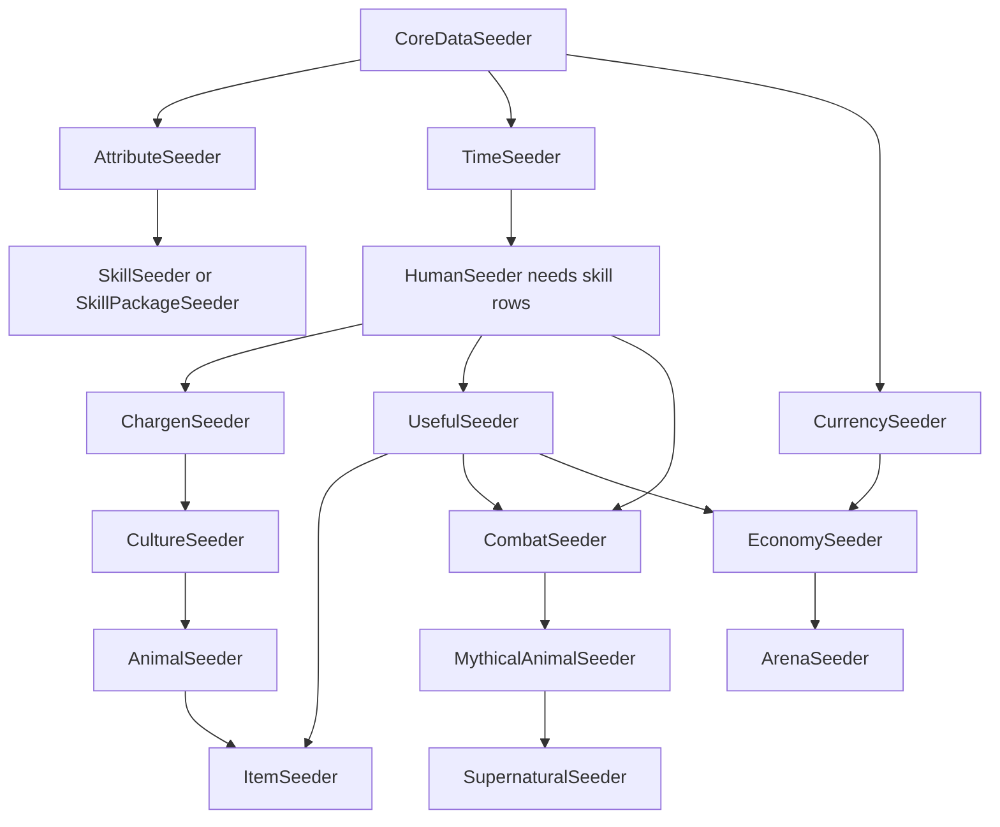

# Seeder dependency map

Baseline: `39eb9d32d2012f56ac3ef33c441b5dac7c3535e3`. The following is transcribed from [SeederMetadataRegistry.GetMetadata](../../../DatabaseSeeder/SeederMetadataRegistry.cs), including disabled/development types. It is not an executed database install order.

`DependencySeederTypes` participates in topological ordering and reports unavailable declared types if omitted from the supplied catalogue. `OrderAfterSeederTypes` contributes an edge only when that type is present. The planner orders ready peers by `SortOrder`, then name. Database prerequisite predicates and `ShouldSeedData` independently determine readiness; they can require stock rows from other packages not represented by a type edge. In particular, Human needs skills but its declared type edges do not select either skill alternative.

The compact diagram highlights common routes. The table is the complete declared edge map. The skill alternatives share stock infrastructure; the Debug replay uses SkillPackageSeeder. Item era/domain preflights (Health, materials, animal gear, technology/food readiness) add important constraints beyond the arrows.

| Seeder | Declared dependency types | Conditional order-after types |
| --- | --- | --- |
| [AIStorytellerSeeder](AIStorytellerSeeder.md) | [CoreDataSeeder](CoreDataSeeder.md) | None |
| [AgricultureSeeder](AgricultureSeeder.md) | [CoreDataSeeder](CoreDataSeeder.md), [UsefulSeeder](UsefulSeeder.md) | None |
| [AnimalButcherySeeder](AnimalButcherySeeder.md) | [CoreDataSeeder](CoreDataSeeder.md), [UsefulSeeder](UsefulSeeder.md), [AnimalSeeder](AnimalSeeder.md) | None |
| [AnimalSeeder](AnimalSeeder.md) | [CoreDataSeeder](CoreDataSeeder.md), [HumanSeeder](HumanSeeder.md), [CultureSeeder](CultureSeeder.md) | None |
| [ArenaSeeder](ArenaSeeder.md) | [EconomySeeder](EconomySeeder.md) | None |
| [ArmageddonMagicSeeder](ArmageddonMagicSeeder.md) | [CoreDataSeeder](CoreDataSeeder.md), [SkillPackageSeeder](SkillPackageSeeder.md), [UsefulSeeder](UsefulSeeder.md), [ItemSeeder](ItemSeeder.md) | None |
| [AttributeSeeder](AttributeSeeder.md) | [CoreDataSeeder](CoreDataSeeder.md) | None |
| [CelestialSeeder](CelestialSeeder.md) | [CoreDataSeeder](CoreDataSeeder.md) | None |
| [ChargenSeeder](ChargenSeeder.md) | [CoreDataSeeder](CoreDataSeeder.md), [HumanSeeder](HumanSeeder.md) | None |
| [ClanSeeder](ClanSeeder.md) | [CoreDataSeeder](CoreDataSeeder.md), [CurrencySeeder](CurrencySeeder.md), [TimeSeeder](TimeSeeder.md) | None |
| [CombatSeeder](CombatSeeder.md) | [CoreDataSeeder](CoreDataSeeder.md), [AttributeSeeder](AttributeSeeder.md), [HumanSeeder](HumanSeeder.md), [UsefulSeeder](UsefulSeeder.md) | None |
| [CookingSeeder](CookingSeeder.md) | [CoreDataSeeder](CoreDataSeeder.md), [UsefulSeeder](UsefulSeeder.md) | None |
| [CoreDataSeeder](CoreDataSeeder.md) | None | None |
| [CultureSeeder](CultureSeeder.md) | [HumanSeeder](HumanSeeder.md), [ChargenSeeder](ChargenSeeder.md) | None |
| [CurrencySeeder](CurrencySeeder.md) | [CoreDataSeeder](CoreDataSeeder.md) | None |
| [EconomySeeder](EconomySeeder.md) | [CoreDataSeeder](CoreDataSeeder.md), [CurrencySeeder](CurrencySeeder.md), [TimeSeeder](TimeSeeder.md), [UsefulSeeder](UsefulSeeder.md) | None |
| [EnvironmentalExposureSeeder](EnvironmentalExposureSeeder.md) | [CoreDataSeeder](CoreDataSeeder.md) | [HumanSeeder](HumanSeeder.md), [AnimalSeeder](AnimalSeeder.md), [AnimalButcherySeeder](AnimalButcherySeeder.md), [CultureSeeder](CultureSeeder.md), [ItemSeeder](ItemSeeder.md), [RobotSeeder](RobotSeeder.md), [SupernaturalSeeder](SupernaturalSeeder.md), [UsefulSeeder](UsefulSeeder.md), [HealthSeeder](HealthSeeder.md), [PsionicsSeeder](PsionicsSeeder.md), [ArmageddonMagicSeeder](ArmageddonMagicSeeder.md) |
| [HealthSeeder](HealthSeeder.md) | [CoreDataSeeder](CoreDataSeeder.md), [HumanSeeder](HumanSeeder.md), [UsefulSeeder](UsefulSeeder.md) | None |
| [HumanSeeder](HumanSeeder.md) | [CoreDataSeeder](CoreDataSeeder.md), [TimeSeeder](TimeSeeder.md) | None |
| [ItemSeeder](ItemSeeder.md) | [UsefulSeeder](UsefulSeeder.md), [AnimalSeeder](AnimalSeeder.md) | None |
| [LawSeeder](LawSeeder.md) | [CoreDataSeeder](CoreDataSeeder.md), [CurrencySeeder](CurrencySeeder.md) | None |
| [MythicalAnimalSeeder](MythicalAnimalSeeder.md) | [HumanSeeder](HumanSeeder.md), [AnimalSeeder](AnimalSeeder.md), [CombatSeeder](CombatSeeder.md) | None |
| [PrimaryProductionSeeder](PrimaryProductionSeeder.md) | [CoreDataSeeder](CoreDataSeeder.md), [UsefulSeeder](UsefulSeeder.md), [ItemSeeder](ItemSeeder.md) | None |
| [PsionicsSeeder](PsionicsSeeder.md) | [HumanSeeder](HumanSeeder.md), [SkillPackageSeeder](SkillPackageSeeder.md), [SupernaturalSeeder](SupernaturalSeeder.md) | None |
| [RobotSeeder](RobotSeeder.md) | [HumanSeeder](HumanSeeder.md), [AnimalSeeder](AnimalSeeder.md), [CombatSeeder](CombatSeeder.md), [UsefulSeeder](UsefulSeeder.md) | None |
| [SkillPackageSeeder](SkillPackageSeeder.md) | [AttributeSeeder](AttributeSeeder.md) | None |
| [SkillSeeder](SkillSeeder.md) | [AttributeSeeder](AttributeSeeder.md) | None |
| [StockMeritsSeeder](StockMeritsSeeder.md) | [CoreDataSeeder](CoreDataSeeder.md), [HumanSeeder](HumanSeeder.md), [ChargenSeeder](ChargenSeeder.md) | None |
| [SupernaturalSeeder](SupernaturalSeeder.md) | [HumanSeeder](HumanSeeder.md), [AnimalSeeder](AnimalSeeder.md), [MythicalAnimalSeeder](MythicalAnimalSeeder.md), [CombatSeeder](CombatSeeder.md), [TimeSeeder](TimeSeeder.md) | None |
| [TimeSeeder](TimeSeeder.md) | [CoreDataSeeder](CoreDataSeeder.md) | None |
| [TrapSeeder](TrapSeeder.md) | [CoreDataSeeder](CoreDataSeeder.md), [SkillPackageSeeder](SkillPackageSeeder.md) | None |
| [UsefulSeeder](UsefulSeeder.md) | [CoreDataSeeder](CoreDataSeeder.md), [HumanSeeder](HumanSeeder.md) | None |
| [WeatherSeeder](WeatherSeeder.md) | [CoreDataSeeder](CoreDataSeeder.md), [CelestialSeeder](CelestialSeeder.md) | None |
| [WildlifeCatalogueSeeder](WildlifeCatalogueSeeder.md) | [CoreDataSeeder](CoreDataSeeder.md), [AttributeSeeder](AttributeSeeder.md), [UsefulSeeder](UsefulSeeder.md), [AnimalSeeder](AnimalSeeder.md) | None |

## State requirements beyond ordering

Each guide lists the exact metadata prerequisite descriptions and points to legacy/dedicated preflights. Do not replace them with “run everything earlier”: a builder-prepared world may satisfy them without the suggested stock package, while an incomplete named package may fail them.

- Core bootstrap has its own fresh/rerun branch; foundation reruns do not create a new world.
- Human needs type-0 skill traits and time/calendar rows; either skill scaffold must actually satisfy its required records.
- Combat requires attribute and skill infrastructure, Human and crossbow tool tags.
- ItemSeeder consumes Useful components/tags and Animal mounted-gear components, then checks the selected domains. Industrial menu availability is not proof of the food readiness gate.
- Creature packages require concrete body, race, health, characteristic and combat identities; their source preflight lists are more detailed than the graph.
- Culture historical toolkit validates native bindings/era immutability before owned writes; legacy packs retain separate paths.
- EnvironmentalExposureSeeder deliberately follows many available domain seeders so it can audit installed materials/fluids; it does not turn exposure on or create hazardous rooms.
- ArmageddonMagicSeeder is excluded from Release; Debug opt-in installs separate prepared-world modules with independent commits. PrimaryProductionSeeder remains disabled even though definitions and ordering metadata exist.

See [shared execution contract](README.md#shared-execution-contract), [coverage](Coverage_and_Evidence.md), and [repeatability strategy](../DatabaseSeeder_Repeatability_Strategy.md).
