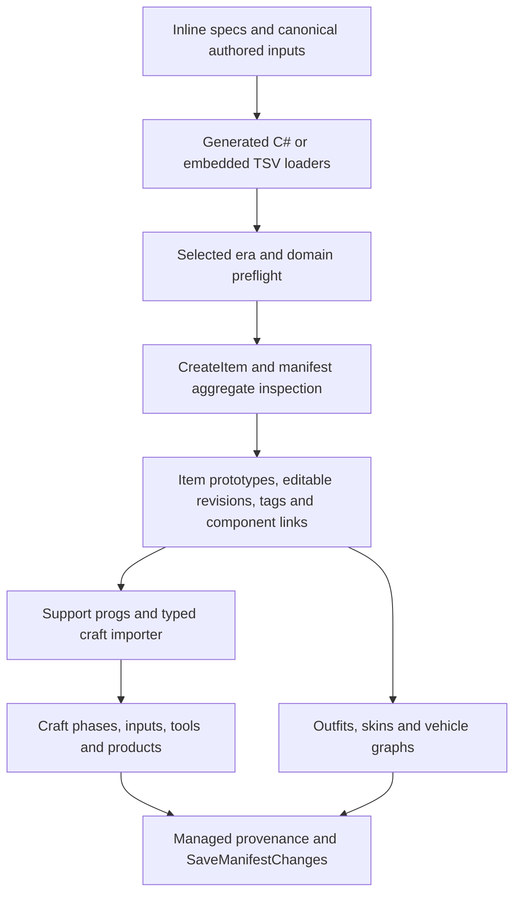

# ItemSeeder

## Start here to add content

Choose the owning seam below before editing. The runtime manifest is a generated ownership inventory, not the easiest place to author a new item. This guide describes commit `39eb9d32d2012f56ac3ef33c441b5dac7c3535e3`; registry presence is not a release announcement or proof of installation readiness.

| Content path | Authoritative first edit | Derived output / integration |
| --- | --- | --- |
| Antiquity inline tools, furniture, equipment | Appropriate `ItemSeeder.Antiquity*.cs` partial; for a small worked example use [household tools](../../../DatabaseSeeder/Seeders/ItemSeeder/ItemSeeder.AntiquityHouseholdTools.cs), `SeedAntiquityHouseholdCraftTools` | `CreateItem`; corresponding `ItemSeeder.Crafting.Antiquity*.cs` if craftable |
| Medieval inline catalogue | Appropriate `ItemSeeder.Medieval*.cs`; [containers](../../../DatabaseSeeder/Seeders/ItemSeeder/ItemSeeder.MedievalContainers.cs), `SeedMedievalContainers` is a direct example | `CreateItem`; Medieval crafting partials |
| Shared durable stock and aliases | [PreIndustrialBaseline](../../../DatabaseSeeder/Seeders/ItemSeeder/ItemSeeder.PreIndustrialBaseline.cs), the source catalogue in [HistoricFoundation](../../../DatabaseSeeder/Seeders/ItemSeeder/ItemSeeder.HistoricFoundation.cs), or the owning primary-production partial | Alias specifications and era admission documents; keep legacy source stable references |
| Renaissance / Early Modern ordinary inline domains | Era/topic partial, such as [Renaissance writing](../../../DatabaseSeeder/Seeders/ItemSeeder/ItemSeeder.Renaissance.WritingPrintAdministration.cs) | `SeedRenaissanceItems` / `SeedEarlyModernItems` in PreIndustrialBaseline dispatch to that domain |
| Renaissance household / military generated records | Canonical design-reference table consumed by its generator (recipes below) | `*.Generated.cs`; do not hand-edit generated records |
| Early Modern household / jewellery / doors | Authored Python catalogues and mappings in their generators | Generated design-reference tables and C# are outputs |
| Pre-industrial prepared food / intermediates / liquids | [FoodCatalogue](../../../DatabaseSeeder/Seeders/ItemSeeder/FoodCatalogue) TSV in Shared, Medieval, Renaissance or EarlyModern | Embedded resources parsed by `PreIndustrialFoodCatalogue`; food components, liquids, items and crafts |
| Renaissance / Early Modern medical and repair | [generate-era-medical-repair-catalogues.py](../../../scripts/generate-era-medical-repair-catalogues.py), `REN`, `EAR`, physical/prose/component mappings | MedicalRepairCatalogue TSVs are generated, then embedded; loader has explicit counts |
| Historical clothing bases / outfits / skins | Era clothing source plus canonical clothing reference; shared physical bases in [HistoricalClothingSources.Data](../../../DatabaseSeeder/Seeders/ItemSeeder.HistoricalClothingSources.Data.cs) | Outfit generator emits `ItemSeeder.ClothingOutfitManifestData.Generated.cs` |
| Vehicles | [vehicle example catalogue](../../../DatabaseSeeder/Seeders/ItemSeeder/ItemSeeder.Vehicles.Catalogue.Examples.PreIndustrial.cs), or corresponding Modern / expanded partial and factory | Vehicle specs become exterior items, component prototypes and vehicle graph rows |
| Industrial ordinary items | [IndustrialisedCatalogue/Items](../../../DatabaseSeeder/Seeders/IndustrialisedCatalogue/Items) domain TSV; associated pricing evidence, crafts and technology bindings | Embedded loader and `SeedIndustrialisedCatalogueItems` |
| Industrial clothing | [IndustrialisedCatalogue/Clothing](../../../DatabaseSeeder/Seeders/IndustrialisedCatalogue/Clothing) related TSV graph | Header-only at this baseline; loader/ownership implementation exists, no existing garment entry to trace |
| Industrial food | [IndustrialisedCatalogue/Food](../../../DatabaseSeeder/Seeders/IndustrialisedCatalogue/Food) concept/dependency/evidence graph | Development admissions; `EnsureProductionReadyForSeeding` blocks non-ready concepts; no live food persistence recipe at this revision |

Use the established [item authoring guidelines](../../Items/Item_Authoring_Guidelines.md), [shared era architecture](../Era_Seeder_Shared_Architecture.md), [item content workflows](../../Items/Item_System_Content_Workflows.md), and [AddCraft guide](../../Items/ItemSeeder_AddCraft_Guide.md). The following recipes explain repository data flow; those guides own narrative and runtime component contracts.

## Purpose, choices and prerequisites

`ItemSeeder` (`Name = "Items"`) installs stock item/craft/outfit/vehicle aggregates. `SeederCatalogue.GetEnabledSeeders` discovers it through `IDatabaseSeeder`; no manual Program registration or directory scan is required.

`SeederQuestions` in [ItemSeeder.cs](../../../DatabaseSeeder/Seeders/ItemSeeder/ItemSeeder.cs) declares `eras`, conditional `technologyprofile`, five custom technology fields (`technologypower`, `technologypaper`, `technologytelecom`, `technologynetworkmedia`, `technologyvehicle`), and rerun `scope` (`all` or `blackpowder`). Normalization canonicalizes aliases and orders remembered selections. `ResolveSelectedEras` merges installed and requested eras; narrower selections do not uninstall prior stock. The [era registry](../../../DatabaseSeeder/Seeders/ItemSeeder.IndustrialisedArchitecture.cs) admits Antiquity, Medieval, Renaissance, Early Modern and Industrial. `revolution` aliases Industrial. Modern, Nuclear/`atomic`, Information/`computer` exist as non-selectable entries; their vehicle spec data does not make them ordinary selectable eras.

[Metadata](../../../DatabaseSeeder/SeederMetadataRegistry.cs), the legacy `ShouldSeedData`, and `AssessSeedData` require Useful components/tags and animal-mounted wear gear. Run the appropriate Core, attributes/skills, Human, Useful, Animal and combat foundations first. Domain preflights add exact material, full tag-path, component and trait requirements. Renaissance military and jewellery/doors have dedicated dependency checks. Historical medical stock requires Health at the matching tier. Industrial additionally resolves an immutable remembered technology profile, checks all catalogue dependencies and clothing ownership, and calls the food production-readiness gate. The dependency map's ordering hints cannot replace these database predicates.

## Execution, writes and ownership



`SeedData` loads `ItemSeederManifestCatalogue.LoadForRuntime`, resolves eras, starts a relational transaction, initializes caches, performs preflights, seeds items, saves item IDs before crafting, creates support progs, seeds crafts, then vehicles, retires missing ownership records and saves/commits. The black-powder scope executes a smaller support item/craft branch in the same transaction pattern. Capture-only execution rolls back a relational transaction. Exceptions roll back and propagate to the shared executor. Non-relational test/capture contexts do not provide a relational rollback guarantee.

`CreateItem` builds an item manifest definition, registers dependencies and ownership policy, matches stable `UniqueName` (or a narrowly eligible exact legacy short-description match), allocates `(Id, RevisionNumber = 0)` explicitly, creates approved `EditableItem`, `GameItemProto`, `GameItemProtosTags`, and `GameItemProtosGameItemComponentProtos` rows. Weight is in grams; price is in base-currency units. Lifecycle references resolve to target item IDs. Missing tags/components may return null on this low-level path; higher-level catalogue preflights or callers commonly turn that into a useful failure. Never infer that an unattended success string proves every proposed item materialized.

`ItemSeeder.Manifest.cs` owns `RegisterManifestAggregate`, `InspectManifestAggregate`, `RecordAppliedManifestEntry`, and `RetireMissingManagedRecords`. Durable `SeederManagedRecords` store entity type/stable key, logical ID/revision and applied fingerprint. Untouched tracked stock can be updated; builder-modified graphs are generally preserved and reported; unmanaged signature/identity conflicts block. Removing a definition retires provenance, not world entities. Item, component, craft, outfit, skin and vehicle aggregate policies differ; inspect the owning graph helper before claiming field-by-field preservation. In particular, the pre-industrial food item helper reassigns fields after `CreateItem` (see observations), so the general preservation statement is not an unconditional guarantee for every domain.

`AddCraft` in [Crafting.cs](../../../DatabaseSeeder/Seeders/ItemSeeder/ItemSeeder.Crafting.cs) parses compact strings into typed specs, validates references and phase/product consistency, and writes `Crafts`, `EditableItems`, `CraftPhases`, `CraftInputs`, `CraftTools`, `CraftProducts` and required access/knowledge relationships. Product IDs come from the seeded item cache, never a guessed numeric ID. Follow the AddCraft guide for emote and variable-product syntax.

## Worked recipes and representative traces

These are source-checked authoring instructions, not changes made or executed by this documentation task. Research citations belong in the owning source/reference/evidence seam. Example names below are illustrative until historical admission and physical values have been reviewed.

### Antiquity: one researched tool

Existing `antiquity_bronze_hand_saw` is a real trace: `SeedData` → `SeedReworkItems` → Antiquity manifest module → `SeedAntiquityHouseholdCraftTools` → `CreateAntiquityHouseholdCraftTool` → `CreateItem` → prototype/revision/tag/component joins → `RecordAppliedManifestEntry` → save/commit. The helper adds the professional-tools market tag and Holdable plus size-dependent Destroyable component. It does not automatically create a recipe.

To add a researched bronze veneer saw, establish period form, dimensions, material, weight and relative price in the relevant design reference. Add one call beside the saw with a new immutable `antiquity_*` stable key, noun, short/full descriptions, `SizeCategory`, gram weight, decimal cost, canonical material and full functional tag path. For example, after reviewing those values:

```csharp
CreateAntiquityHouseholdCraftTool("antiquity_bronze_veneer_saw", "saw",
    "a small bronze veneer saw", "A fine-toothed bronze blade is seated in a short wooden grip.",
    SizeCategory.VerySmall, 80.0, 8.0m, "bronze",
    ["Functions / Tools / Woodcrafting Tools / Saws / Hand Saw"]);
```

This is a signature example with illustrative physical values; review the final researched form and values before admission. Check Useful's tag authority and material presence. Decide explicitly whether the tool is craftable; if so add the appropriate craft in the owning Antiquity crafting partial using the new stable reference and real input/tool tags. Existing household crafts classify selected functional roots; a new workshop-tool tag is not automatically an eligible household craft. Regenerate ownership inventory after source edits; inspect its item and craft entries and verify no accidental extra era admission.

### Medieval: one direct catalogue item

Existing `medieval_locking_trade_clerk_coin_lockbox` in `SeedMedievalContainers` passes ash, physical values, container/household/market tags and `LockingContainer_Lockbox` to `CreateItem`; `SeedReworkItems` routes only the Medieval module to that helper. Add one physically distinct lockbox beside it with a new stable reference, descriptions and reviewed dimensions/price, retaining the direct call's full argument shape. Reuse a fitting stock container component; component dimensions/behavior are owned by Useful, not implied by prose. Add a recipe in the Medieval craft path if intended, and check component/tag prerequisites, manifest identity and era isolation. Clothing uses its own source and outfit recipes below.

### Shared stock and aliases

`PreIndustrialNewItemSpecs` includes `preindustrial_firearms_powder_horn`; `SeedPreIndustrialMilitarySupportGoods` → `SeedPreIndustrialGunpowderSupportItems` → `SeedPreIndustrialNewItems(GunpowderSupport)` create common stock through `CreateItem`. The same shared stage also calls historical workshop and primary-production stock helpers. `PreIndustrialAntiquityAliasStableReferences` / Medieval mappings promote selected earlier physical definitions via `CreatePreIndustrialAlias` or the alias-item helper; source references remain intact and builder notes record attribution. Lifecycle alias endpoints must resolve to shared aliases when both endpoints are promoted.

For a reusable new good, first decide whether it is new shared stock or promotion of an existing source item. Add a new reviewed `PreIndustrialItemSpec` to the correct group, or add one source→alias mapping for an existing physical entry. Reuse its actual material/components and rewrite only approved alias-facing details. Confirm group dispatch includes the new row and explicitly review Medieval/Renaissance/EarlyModern admissions. Regenerate admission exports with the repository generators; do not create a second era-specific copy just to expose durable shared stock. Tests: `PreIndustrialBaselineTests`, `PreIndustrialAdmissionManifestTests`.

### Renaissance / Early Modern generated household and military

Renaissance household rows and Renaissance/Early Modern military tables are parsed authoring inputs. Follow their canonical table schema, description overlay and admitted dependency/profile ledger, then regenerate the C# output. Renaissance military produces `RenaissanceMilitaryItemSpecs`, validates materials/tags/components and writes items plus armour outfit manifests. Early Modern military uses a supported-component ledger rather than emitting every design row.

Early Modern household is a different architecture. Existing `earlymodern_household_tea_caddy` starts in the Python `LEGACY` tuples in [generate-earlymodern-household-manifest.py](../../../scripts/generate-earlymodern-household-manifest.py), joins `CULTURES`, forms and target mappings through `new_specs()`, and generates both the household design catalogue and `EarlyModernHouseholdItemSpecs`. `SeedEarlyModernHouseholdCoffeehouseTavernAndTrade` consumes those specs through `CreateItem`. Add one researched entry to the generator's authored form/`LEGACY` construction and corresponding mappings, then regenerate the design-reference row block and C#. Those marked generated tables are outputs, not the authoritative edit location.

Jewellery/doors are also Python-authored. Existing `renaissance_jewellery_wer_ring_01` comes from [generate-renaissance-earlymodern-jewellery-doors.py](../../../scripts/generate-renaissance-earlymodern-jewellery-doors.py): `make_preindustrial`, `make_renaissance_common`, `make_renaissance_specific` and `make_early_modern_specific` construct the canonical catalogue. The script emits design references, CSVs and C# consumed by `SeedRenaissanceJewelleryAndDevotionalGoods` and the matching era/door helpers, then `CreateItem`. Add a reviewed distinct form to the owning construction and its material/physical/tag/component/prose mappings; check shared-versus-era admission before regenerating all outputs. Editing a generated design-reference row will not change the source catalogue.

For either architecture, run the owning Python generator and inspect all output diffs plus its available check/count/profile invariants. Do not hand-edit generated records. Follow with item ownership-manifest capture and focused domain checks in a future content change; none was run for this documentation task.

Canonical references and generators:

- [Renaissance household](../FutureMUD_Renaissance_Household_Urban_Trade_Design_Reference.md) → [generator](../../../scripts/generate-renaissance-household-manifest.py), parsed source table.
- [Early Modern household emitted catalogue](../FutureMUD_EarlyModern_Household_Furniture_Container_Design_Reference.md) ← [generator](../../../scripts/generate-earlymodern-household-manifest.py). The [coffeehouse/tavern/trade reference](../FutureMUD_EarlyModern_Household_Coffeehouse_Tavern_Trade_Design_Reference.md) is a contextual wrapper that links the generated catalogue.
- [Renaissance military](../FutureMUD_Renaissance_Military_Firearms_Armour_Design_Reference.md) → [generator](../../../scripts/generate-renaissance-military-manifest.py).
- [Early Modern military](../FutureMUD_EarlyModern_Military_Firearms_Uniforms_Naval_Design_Reference.md) → [generator](../../../scripts/generate-earlymodern-supported-military-manifest.py).
- [Renaissance jewellery](../FutureMUD_Renaissance_Jewellery_Devotional_Seeder_Design_Reference.md) and [Early Modern jewellery](../FutureMUD_EarlyModern_Jewellery_Devotional_Seeder_Design_Reference.md), door references and shared catalogue ← jewellery/doors generator outputs.

Other Renaissance/EarlyModern inline domains use `EraCatalogueItemSpec`/`SeedStraightforwardEraCatalogueItems` or direct specialized helpers. Add one record to the already-dispatched owning topic catalogue; do not assume generated household edits extend writing, science, agriculture or culture-manifest domains. `SeedRenaissanceItems` and `SeedEarlyModernItems` list those integration points exactly.

Two concrete inline traces are `renaissance_writing_civic_warrant` in [SeedRenaissanceWritingPrintAndAdministration](../../../DatabaseSeeder/Seeders/ItemSeeder/ItemSeeder.Renaissance.WritingPrintAdministration.cs) and `earlymodern_writing_gazette` in [SeedEarlyModernWritingPrintAdministrationAndFinance](../../../DatabaseSeeder/Seeders/ItemSeeder/ItemSeeder.EarlyModern.WritingPrintAdministrationFinance.cs). Each selected-era dispatcher reaches the topic method, whose `EraCatalogueItemSpec` records flow through [SeedStraightforwardEraCatalogueItems](../../../DatabaseSeeder/Seeders/ItemSeeder/ItemSeeder.EraCatalogueSupport.cs): dependency checks, then `CreateItem` and the prototype/revision/tag/component ownership path described above. For a worked additional administrative sheet, add a peer record with a new immutable era-prefixed key, reviewed material/grams/cost/prose and an appropriate existing paper component/tag set. Verify selected-era admission and any separate craft; the document's written content remains builder-authored.

### Pre-industrial food: one loaf and one liquid

Existing `preindustrial_food_hearth_wheat_loaf` is a row in `Shared/grain-bread.food-items.tsv`. `PreIndustrialFoodCatalogue.ReadItemResources` verifies header/cell types → `SeedPreIndustrialFoodCatalogueScope(Shared)` → `UpsertPreIndustrialFoodItem` → `UpsertPreparedFoodComponent` builds PreparedFood XML from nutrition/freshness bands → `CreateItem` with the component → tag/component reconciliation. `SeedPreIndustrialFoodCatalogueCrafts` adds crafts after item IDs exist. `Shared/shared.food-liquids.tsv` is separately parsed and `UpsertPreIndustrialFoodLiquid` creates/reuses liquid records and tags; crafts can emit liquids in the shared catalogue amphora. Existing externally owned same-name liquids are reused without claiming/overwriting them.

Add a distinct reviewed loaf row to the owning food-items TSV, preserving the 15-column header: stable reference, scope, kind, family, noun, short/full prose, taste, material, nutrition, freshness, quality, grams, cost, admission profile. Use valid enum values and canonical material, unique prose/key and correct era admission. A prepared loaf uses `Prepared`; a discrete intermediate uses its supported kind and Stack_Number pathway. Add liquids to food-liquids TSV with that loader's separate header and numeric fields; never treat a beverage as a solid item row. Both are embedded by the csproj wildcard, so no new menu registration is needed. Read parser/runtime validation and fixed-count/admission tests before changing counts. Update generated food admission/catalogue exports with the owning scripts; verify the craft classification produces the desired actual product. Cross-reference [food design](../PreIndustrial_Food_Catalogue_Design_Reference.md), `PreIndustrialFoodCatalogueTests`, and `PreIndustrialFoodCatalogueCraftSeedingTests`.

### Medical and repair: generator-owned TSV

Existing Renaissance cupping-glass stock appears in `REN['Clinical surgery']` → generator material/prose/component maps → `renaissance.medical-repair.tsv` → `EraMedicalRepairCatalogue.ReadResources` → `ToItemSpec` → `SeedRenaissanceMedicalAndRepair` → `SeedStraightforwardEraCatalogueItems` → `CreateItem`. Early Modern deliberately installs the Renaissance baseline plus distinct Early Modern additions.

Add one distinct form in `REN` or `EAR` and supply its intended material, components, tags, prose and cost rules in the generator. Update intentional count/category contracts in `EraMedicalRepairCatalogue.Validate` and focused tests; the existing 134+44 counts reject a casual appended row. Generate both TSVs, verify three-sentence prose, required repair-target tags or era-appropriate delivery component, and Health preflight. Do not introduce fake institution/colour/price-tier duplicates. Tests: `ItemSeederEraMedicalRepairCatalogueTests`, `RenaissanceEarlyModernMedicalFoundationTests`.

### Historical clothing, skins and outfit templates

Existing generated `antiquity_fine_pleated_kalasiris` is an `AntiquityOutfitSupplementalItemSpecs` row → `SeedDocumentedClothingOutfitManifests` → `SeedDocumentedClothingItems` → `CreateItem`; skin specs resolve a base item and `UpsertOutfitManifests` persists templates/entries with item/skin IDs and load arguments. Era clothing sources also define physical bases and variable-colour craft products. The outfit generator reads Antiquity/Medieval/Renaissance/EarlyModern clothing references, Medieval C# and shared historical source records; a reference table is not uniformly the sole authority for every physical base.

Add one reviewed physical garment in the owning era/shared-base source, with a matching human wear component and actual `$colour` variables if colorable. Add its stable reference to the relevant canonical outfit table, or add a skin on an existing physically identical base rather than inventing a duplicate base. Run `generate-item-seeder-outfit-manifests.py`, inspect supplemental item/skin/outfit records and validate placement, coverage and variable-product mappings. Rebuild variable craft products through `SimpleVariableProduct`, not a post-create patch. Verify `ItemSeederClothingOutfitManifestTests`, `HistoricalClothingColourTests` and the era crafting tests. No generated output is edited by hand.

### Vehicles: one graph, not only an exterior item

Existing `vehicle_antiquity_two_wheeled_handcart` → `AntiquityVehicleExamples` → `CreateDraftCargoVehicle` factory → `VehicleExampleSpecs` → `SeedVehicleItemsAndPrototypes` → `UpsertVehiclePrototype` in [Persistence.cs](../../../DatabaseSeeder/Seeders/ItemSeeder/ItemSeeder.Vehicles.Persistence.cs). That helper registers the vehicle aggregate, checks live-graph fingerprint/ownership, creates the exterior through `CreateItem`, adds `VehicleProtos`, generates/links exterior and projection components, then writes compartments, links, occupant slots, control stations, propulsion/movement profiles and other child graph records. Vehicle graphs and associated components use dedicated ownership policies.

Add one example through the correct terrestrial/water factory with a unique vehicle key and era token. Supply exterior physical/narrative values, compartments, occupants, scale/capacity, route/movement/propulsion parameters and trait/fuel references. Extend child specs only where the factory cannot express the vehicle. Validate key uniqueness, graph references, movement formulas and component dependencies in the existing validation helpers; do not insert only an exterior `GameItemProto`. Check `VehicleSeederTests` and the [vehicle design reference](../Vehicle_Item_Seeder_Design_Reference.md). Later-era example factories are source-present but cannot bypass non-selectable ordinary eras.

### Industrial ordinary items and developmental domains

Existing `industrialised_tools_repair_machinery_0001_plain_scrap` → embedded `tools-repair-machinery.items.tsv` → `IndustrialisedItemCatalogue.LoadInternal` / `LoadSources` → `SeedIndustrialisedCatalogueItems` filters `EraAdmissions` and orders layer/key → `ResolveIndustrialisedComponents` combines fixed names with technology-profile bindings → `CreateItem`. Related `crafts.tsv` records resolve a real seeded product and call `AddCraft`; `Pricing/historical-price-evidence.tsv` supplies authoring provenance, not an automatic price calculation at install time.

Add one researched ordinary tool row to the domain TSV using the exact 24-column schema in [IndustrialisedItemCatalogue.cs](../../../DatabaseSeeder/Seeders/IndustrialisedItemCatalogue.cs). Keep a unique stable reference, valid layer/admissions, complete physical prose and units, actual component/tag names, explicit supported claims and lifecycle targets. Add a reviewed price-evidence ID/row; derive the proposed cost using the [pricing methodology](../FutureMUD_Industrialised_Historical_Pricing_Methodology.md) rather than imply the installer converts historical currencies. If craftable, add the associated typed TSV craft row with product key, trait/minimum, difficulty, input material and grams. Profile-backed components require a resolvable dimension/family binding; do not add ItemSeeder questions for individual components. Validate loader/domain tests and sync exports using the owning scripts.

Industrial clothing graph sources are empty at this baseline. Its implemented loaders, colour/physical/dependency/craft plans and item/skin/outfit/craft ownership helpers are real integration code, but there is **no existing catalogue garment** for a representative persistence trace. Adding one is a coordinated graph-authoring task: bases + physical binding/reuse source + colour palette/bindings + optional skins + outfits/entries + crafts/phases/inputs/tools/products and production-route review. Follow [clothing infrastructure evidence](../Industrialised_Clothing_Wave2_Infrastructure_and_Gate2.md) and `IndustrialisedClothing*Tests`; a one-row claim would be misleading.

Industrial food has existing concept `industrialised_food_staples_001` in `concepts.tsv`, with ingredient/nutrition/diet/freshness/production/failure/evidence joins. `IndustrialisedFoodCatalogue.Load` validates that graph, and `EnsureProductionReadyForSeeding` rejects its `DependencyReviewed` state. No food installation path turns that concept into a finished prepared-food item at this revision. Add a proposed distinct concept only with corresponding graph joins and reviewed evidence, maintaining intentional count contracts and `IndustrialisedFoodCatalogueTests`. Do not mark it ProductionReady solely to get past preflight. This recipe ends at validated development data; actual production activation is outside this task.

## Generated outputs and verification

`Seeded_Item_Manifest.json` is generated by `Program.TryCaptureItemManifest` / `ItemSeeder.CaptureManifest`. The in-memory CLI flag is `--capture-item-manifest-in-memory`; the relational capture path has explicit connection configuration and is not a normal content-authoring prerequisite. Runtime loads packaged `Assets/Manifests/Seeded_Item_Manifest.json` first, otherwise the repository file and source-fingerprint check. Embedded TSVs and generated partials must exist before capture. Build/publish packaging is defined by [DatabaseSeeder.csproj](../../../DatabaseSeeder/DatabaseSeeder.csproj), not a hand-copied executable directory.

For a future content change: run the owning generator's check, loader/source tests, item-manifest invariants and selected-era first-install/rerun/preservation tests, adding a focused regression for the new contract. Use the repository verification map and `-m:1` for direct .NET commands. Source/graph checks alone do not establish installed physical behavior. This documentation task ran no capture, generator mutation, build, test suite or database; validation receipts are in [Coverage and evidence](Coverage_and_Evidence.md).

## Observations for triage

- Source prose says ItemSeeder does not create component prototypes, but food and vehicle paths explicitly do. The ordinary-item consumption contract is narrower than that global wording.
- `UpsertPreIndustrialFoodItem` sets fields and reconciles links after `CreateItem` can return a customized item. Static reading suggests builder customization may be overwritten on this path; targeted rerun evidence is needed before promising preservation. No repair was attempted.
- `ComputeSourceFingerprint` enumerates `ItemSeeder*.cs` inside the ItemSeeder directory and root `Industrialised*.cs`, but several root `ItemSeeder.*.cs` helpers are outside those globs. This is a potential fingerprint coverage gap; source edits there may not invalidate the manifest fingerprint.
- Industrial is selectable but food preflight rejects non-ProductionReady concepts. Existing guides must distinguish the menu gate from successful installability. No activation change is implied.

See [shared execution contract](README.md#shared-execution-contract), [dependency map](Dependency_Map.md), and [coverage matrix](Coverage_and_Evidence.md).
