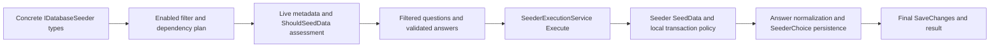

# Database seeder source and authoring guides

These internal maintainer guides describe the pinned published master revision `39eb9d32d2012f56ac3ef33c441b5dac7c3535e3` (verified with `git ls-remote origin refs/heads/master` on 2026-10-06). They are a source map and authoring reference, not a public feature announcement or database execution receipt. Later source deltas have not been reconciled.

There are **34 concrete seeders** in the DatabaseSeeder executable: 32 enabled in Release, one disabled (`PrimaryProductionSeeder`), and one Debug-only (`ArmageddonMagicSeeder`). The abstract `SkillSeederBase` is supporting infrastructure for the two concrete skill alternatives. Disabled catalogue definitions and non-selectable item eras are included. Reflection discovery includes internal concrete classes; a source folder does not register or activate content.

## Inventory

| Seeder guide | Baseline availability | Declared repeatability / update |
| --- | --- | --- |
| [AIStorytellerSeeder](AIStorytellerSeeder.md) | Enabled | Idempotent / RepairExisting |
| [AgricultureSeeder](AgricultureSeeder.md) | Enabled | Idempotent / RepairExisting |
| [AnimalButcherySeeder](AnimalButcherySeeder.md) | Enabled | Idempotent / RepairExisting |
| [AnimalSeeder](AnimalSeeder.md) | Enabled | Idempotent / FullReconcile |
| [ArenaSeeder](ArenaSeeder.md) | Enabled | Idempotent / RepairExisting |
| [ArmageddonMagicSeeder](ArmageddonMagicSeeder.md) | Debug only; disabled in Release | Idempotent / RepairExisting |
| [AttributeSeeder](AttributeSeeder.md) | Enabled | Idempotent / FullReconcile |
| [CelestialSeeder](CelestialSeeder.md) | Enabled | Additive / InstallMissing |
| [ChargenSeeder](ChargenSeeder.md) | Enabled | Idempotent / RepairExisting |
| [ClanSeeder](ClanSeeder.md) | Enabled | Additive / InstallMissing |
| [CombatSeeder](CombatSeeder.md) | Enabled | Idempotent / FullReconcile |
| [CookingSeeder](CookingSeeder.md) | Enabled | Idempotent / InstallMissing |
| [CoreDataSeeder](CoreDataSeeder.md) | Enabled | Idempotent / RepairExisting |
| [CultureSeeder](CultureSeeder.md) | Enabled | Idempotent / RepairExisting |
| [CurrencySeeder](CurrencySeeder.md) | Enabled | Additive / InstallMissing |
| [EconomySeeder](EconomySeeder.md) | Enabled | Additive / RepairExisting |
| [EnvironmentalExposureSeeder](EnvironmentalExposureSeeder.md) | Enabled | Idempotent / RepairExisting |
| [HealthSeeder](HealthSeeder.md) | Enabled | Idempotent / RepairExisting |
| [HumanSeeder](HumanSeeder.md) | Enabled | Idempotent / FullReconcile |
| [ItemSeeder](ItemSeeder.md) | Enabled | Idempotent / FullReconcile |
| [LawSeeder](LawSeeder.md) | Enabled | Idempotent / RepairExisting |
| [MythicalAnimalSeeder](MythicalAnimalSeeder.md) | Enabled | Idempotent / InstallMissing |
| [PrimaryProductionSeeder](PrimaryProductionSeeder.md) | Disabled | Idempotent / RepairExisting |
| [PsionicsSeeder](PsionicsSeeder.md) | Enabled | Idempotent / RepairExisting |
| [RobotSeeder](RobotSeeder.md) | Enabled | Idempotent / InstallMissing |
| [SkillPackageSeeder](SkillPackageSeeder.md) | Enabled | Idempotent / RepairExisting |
| [SkillSeeder](SkillSeeder.md) | Enabled | Idempotent / RepairExisting |
| [StockMeritsSeeder](StockMeritsSeeder.md) | Enabled | Idempotent / RepairExisting |
| [SupernaturalSeeder](SupernaturalSeeder.md) | Enabled | Idempotent / RepairExisting |
| [TimeSeeder](TimeSeeder.md) | Enabled | Idempotent / RepairExisting |
| [TrapSeeder](TrapSeeder.md) | Enabled | Idempotent / RepairExisting |
| [UsefulSeeder](UsefulSeeder.md) | Enabled | Idempotent / InstallMissing |
| [WeatherSeeder](WeatherSeeder.md) | Enabled | Idempotent / RepairExisting |
| [WildlifeCatalogueSeeder](WildlifeCatalogueSeeder.md) | Enabled | Idempotent / FullReconcile |

See [dependency map](Dependency_Map.md) for exact declared edges, and [coverage and evidence](Coverage_and_Evidence.md) for representative traces, observations and limits. [ItemSeeder](ItemSeeder.md) contains separate recipes for materially different eras and data paths.

## Document convention

Each concrete class has one guide named `<ClassName>.md`. It starts with the least complicated authoritative edit seam, then covers operator choices and prerequisites, source/asset provenance, an existing entry through transforms and EF writes, a worked addition, transaction/rerun/ownership limits and verification references. Exact symbols and source files are linked; the owning design guide retains its detailed narrative/runtime contract. Metadata summaries are explicitly declarations, not evidence of every helper preserving builder fields.

## Shared execution contract

The entrypoints are [Program](../../../DatabaseSeeder/Program.cs), [SeederCatalogue](../../../DatabaseSeeder/SeederCatalogue.cs), [IDatabaseSeeder](../../../DatabaseSeeder/IDatabaseSeeder.cs), [SeederMetadataRegistry](../../../DatabaseSeeder/SeederMetadataRegistry.cs), [SeederQuestionRegistry](../../../DatabaseSeeder/SeederQuestionRegistry.cs), [SeederAnswerMemory](../../../DatabaseSeeder/SeederAnswerMemory.cs) and [SeederExecutionService](../../../DatabaseSeeder/SeederExecutionService.cs).

`SeederCatalogue.GetEnabledSeeders` reflects the executing assembly, excludes abstract types, instantiates concrete `IDatabaseSeeder` implementations and filters `Enabled`. `Enabled` defaults to true; `SafeToRunMoreThanOnce` defaults to false and is a legacy signal. Concrete metadata declares repeatability, update capabilities, database-backed prerequisite predicates and ordering edges. `Assess` combines those predicates with legacy readiness; a single marker or an `ExtraPackagesAvailable` result is not a complete installed-content or safety check.

`Program.DoSeederQuestions` uses enhanced questions, live filters, validators, defaults and generic answer memory. A question can be declared but inactive. Shared answer keys intentionally carry compatible choices between packages. [SeederQuestionRegistry](../../../DatabaseSeeder/SeederQuestionRegistry.cs) suppresses persistence of the Core password. Do not duplicate menu numbers or bypass validation in new content-authoring instructions.

`SeederExecutionService.Execute` calls `SeedData`, normalizes answers for `ISeederAnswerNormalizer`, persists answers, and performs another `SaveChanges`. An exception rolls back only a currently active transaction and clears tracked changes. It does **not** supply one transaction covering all seeders, undo a transaction already committed inside `SeedData`, or reverse work saved without a transaction. A failure saving answer memory after a seeder commit can leave content installed. A returned warning string is still a successful execution unless an exception is raised. Each guide describes its own boundary.

`SeederRepeatabilityHelper` provides stable-name ensure/classification/prog helpers; it is not a universal ownership ledger. `SeederManagedRecordReconciler` and consumer-specific provenance/field-baseline implementations protect different ownership scopes. Read each consumer before promising preservation. [Repeatability strategy](../DatabaseSeeder_Repeatability_Strategy.md) owns the goals and taxonomy.

## Supporting sources and assets

| Support surface | Role / authority |
| --- | --- |
| [SkillSeederBase](../../../DatabaseSeeder/Seeders/Utilities/Skills/SkillSeederBase.cs) | Shared checks, decorators, improvers, trait/prog helpers for SkillSeeder and SkillPackageSeeder; not a selectable seeder. |
| [Seeders/Utilities](../../../DatabaseSeeder/Seeders/Utilities) | Shared anatomy, health, combat, NPC skill, chargen and narrative transforms. Concrete seeder guides link relevant consumers. |
| [DebugSeederReplay](../../../DatabaseSeeder/DebugSeederReplay.cs) | Debug-only deterministic profiles; uses concrete types and shared executor, fresh-target restrictions; full skill package is the profile alternative. |
| [DatabaseSeeder.csproj](../../../DatabaseSeeder/DatabaseSeeder.csproj) | Defines embedded inputs, linked external documents and copied installer assets; the runtime consumes packaged resources rather than scanning authoring directories. |
| [Assets/Database](../../../DatabaseSeeder/Assets/Database) | Blank SQL snapshot and manifest for bootstrap/migration infrastructure; not a concrete IDatabaseSeeder or ordinary content-authoring seam. |
| [Assets/Manifests](../../../DatabaseSeeder/Assets/Manifests) | Reviewed Armageddon content and monster-AI recommendation assets. Item ownership manifest is linked from Design Documents/Seeding. |
| [RPI converter](../../../RPI%20Engine%20Worldfile%20Converter) | Separate importer into an already-seeded world; excluded from installer-seeder inventory. |

Generated ownership manifests, generated C# and export JSON/TSV are distinguished from source inputs in their owning guides. Human narrative markup follows [human patterns](../../Markup/Human_Seeder_Description_Patterns.md), [character descriptions](../../Markup/Character_Description_System.md) and [emotes](../../Markup/Emote_System.md).

## Authoring and verification boundary

A worked example is a maintainer recipe, not newly approved game content. Keep stable identities, dependency names, serialization/units and ownership policy explicit. New question IDs, enabled status, dependencies or replay contracts require the repository database-seeder workflow skill and replay review; ordinary catalogue additions use focused source/loader/domain regressions. Never make a fixed-count invariant disappear merely to admit an unreviewed row.

For future executable changes use the [verification map](../../../.codex/references/verification-and-docs.md) and relevant suite. This task is documentation only: no database connection, migration, seed execution, builds, expensive suites, push or publication occurred. Checks performed here are source traces, relative-link/heading validation, Mermaid structural validation and Git diff checks, as recorded in coverage evidence.
